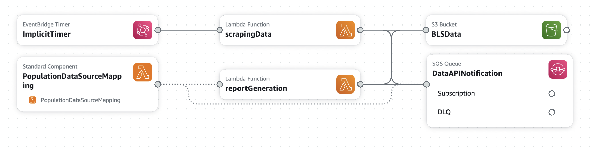

# Rearc Data Quest - Data Processing Pipeline

A serverless data processing pipeline built with AWS SAM that scrapes Bureau of Labor Statistics (BLS) data and DataUSA API data, then generates analytical reports.

## Architecture

This project implements a serverless architecture using AWS SAM with the following components:

- **S3 Bucket**: Stores scraped BLS data and DataUSA API data
- **Lambda Function 1 (scrapingData)**: Scrapes BLS data and DataUSA API data from external APIs
- **Lambda Function 2 (reportGeneration)**: Processes data and generates analytical reports
- **SQS Queue**: Triggers report generation when new data is uploaded
- **EventBridge (CloudWatch Events)**: Provides event-driven scheduling and automation
- **CloudWatch Logs**: Provides monitoring and debugging capabilities



## EventBridge Integration

### Scheduled Events
- **Daily Data Scraping**: Automatically triggers `scrapingData` function every day

### Event-Driven Triggers
- **S3 Object Creation**: Automatically triggers `reportGeneration` when new population data is uploaded to S3

## Data Sources

### BLS Data (Part 1)
- **Source**: https://download.bls.gov/pub/time.series/pr/
- **Storage**: S3 bucket with prefix `part1/`
- **Format**: Tab-delimited files with `.Current` extension
- **Content**: Employment and labor statistics time series data
- **Sample File from S3 Bucket**:https://rearc-data-quest-v3-blsdata-290950245089.s3.us-east-1.amazonaws.com/part1/pr.data.0.Current

### Population Data (Part 2)
- **Source**: DataUSA API (Honolulu)
- **Storage**: S3 bucket with prefix `part2/`
- **Format**: JSON files with timestamps
- **Content**: US population data by year
- **Sample File from S3 Bucket**:https://rearc-data-quest-v3-blsdata-290950245089.s3.us-east-1.amazonaws.com/part2/population_data_2025-08-05T18-24-30Z.json

## Features

### Data Collection
- **Automated Scraping**: Fetches current BLS data files and compares with existing S3 objects
- **Incremental Updates**: Only downloads new or changed files
- **Cleanup**: Removes obsolete files from S3
- **Population Data**: Fetches current population statistics from DataUSA API
- **Event-Driven Scheduling**: Uses EventBridge for reliable daily execution

### Data Analysis
- **Statistical Analysis**: Calculates mean and standard deviation of US population (2013-2018)
- **Time Series Analysis**: Identifies best performing years for each data series
- **Data Integration**: Merges BLS time series data with population data
- **Data Cleaning**: Strips whitespace and normalizes data types
- **Real-time Processing**: Immediate analysis when new data is available

## Prerequisites

- AWS CLI configured with appropriate permissions
- Python 3.9+ (for local development)
- AWS SAM CLI

## Installation

1. **Clone the repository**
   ```bash
   git clone <repository-url>
   cd RearcProject
   ```

2. **Install dependencies**
   ```bash
   # For Function 1 (Data Scraping)
   pip install -r src/Function/requirements.txt
   
   # For Function 2 (Report Generation)
   pip install -r src/Function2/requirements.txt
   ```

3. **Deploy to AWS**
   ```bash
   sam build
   sam deploy --guided
   ```


## Configuration

The project uses the following environment variables:

- `BLSDATA_BUCKET_NAME`: S3 bucket name for data storage
- `BLSDATA_BUCKET_ARN`: S3 bucket ARN
- `DATA_API_NOTIFICATION_QUEUE_URL`: SQS queue URL for triggering report generation
- `SQS_QUEUE_URL`: SQS queue URL for triggering report generation


### Manual Data Collection
The `scrapingData` function can be invoked manually to collect data:

```bash
aws lambda invoke --function-name scrapingData response.json
```

### Automatic Report Generation
Reports are automatically generated when new population data is uploaded to S3 (triggered via SQS).


### Generated Reports

1. **Population Statistics (2013-2018)**
   - Mean population
   - Standard deviation

2. **Best Year Analysis**
   - For each series_id, identifies the year with the highest summed values
   - Returns: series_id, best_year, max_value

3. **Integrated Data Report**
   - Merges BLS time series data with population data
   - Filters by specific series_id and period (default: PRS30006032, Q01)

## Monitoring

- **CloudWatch Logs**: Each Lambda function has dedicated log groups
- **S3 Notifications**: Automatic triggering of report generation
- **Error Handling**: Comprehensive error logging and exception handling
- **Scheduled Execution**: Daily automated data collection

## Project Structure

```
RearcProject/
├── template.yaml          # SAM template with AWS resources
├── samconfig.toml        # SAM deployment configuration
├── src/
│   ├── srapingData/         # Data scraping Lambda
│   │   ├── handler.py    # Main scraping logic
│   │   └── requirements.txt
│   └── reportGeneration/   # Report generation Lambda
│       ├── handler.py    # Data analysis and reporting
│       └── requirements.txt
└── README.md
```

### Local Testing
```bash
# Test data scraping function
sam local invoke scrapingData --event events/scraping-event.json

# Test report generation function
sam local invoke reportGeneration --event events/report-event.json
```

### Integration Testing
1. Deploy the stack
2. Manually invoke the scraping function
3. Verify S3 objects are created
4. Check that report generation is triggered automatically


### Data Sources
- **BLS Data**: https://download.bls.gov/pub/time.series/pr/
- **Population Data**: https://honolulu-api.datausa.io/tesseract/data.jsonrecords

### Debugging
- Check CloudWatch logs for each Lambda function

## Output Files
- **CloudWatch_logs.csv**: Contains final outputs for three specific questions, based on pre-processed data
- **Report_Generation.ipynb**: Jupyter notebook with detailed analysis functions and data processing logic